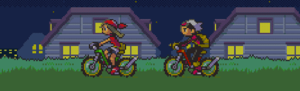

<h1 align="center">Hello world , I'm Josh!</h1>
<h3 align="center">A software engineering student at the University of Guelph</h3>

  

- 💻 6x SWE Intern and 6x Teaching Assistant

- 🏆 Fun fact: I won top male athlete of the year in school

- 📫 How to reach me: **jkomonen@uoguelph.ca**

<h3 align="left">Languages and Tools:</h3>

  

